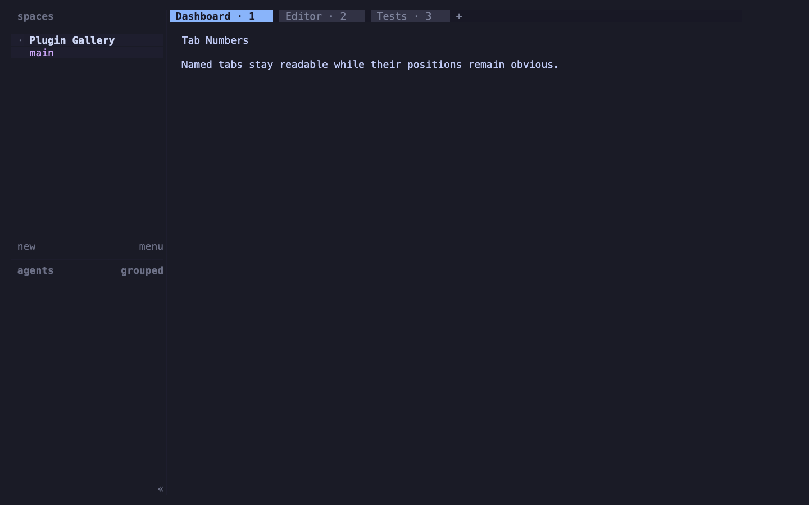
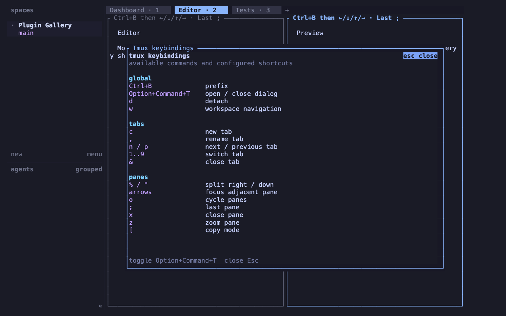
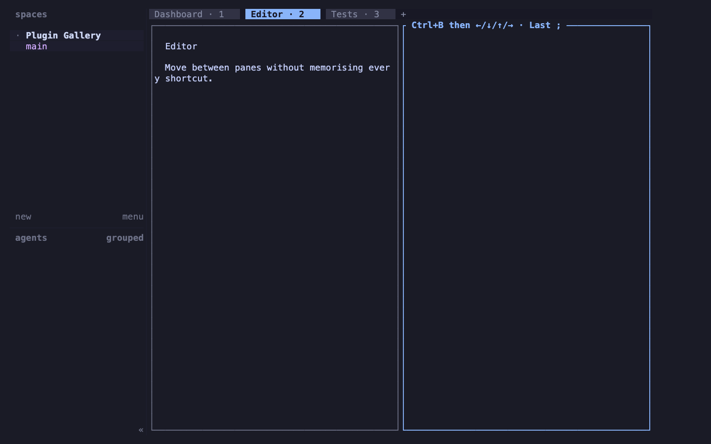

# Herdr plugins

Focused, independently installable plugins for [Herdr](https://herdr.dev/).

## Install

To use every plugin in this repository, install Herdr 0.7.4 or newer and Node.js 24.12 or newer within the Node.js 24 release line. Each plugin is installed separately, so choose only what you need.

### Tab Numbers

Install the plugin, then number any tabs that already exist:

```sh
herdr plugin install oullin/herdr-plugins/plugins/tab-numbers
herdr plugin action invoke oullin.tab-numbers.sync
```

### Tmux Keybindings

Install the plugin, then apply the tmux-style profile:

```sh
herdr plugin install oullin/herdr-plugins/plugins/tmux-keybindings
herdr plugin action invoke oullin.tmux-keybindings.apply
```

### Pane Navigation Hints

Install the plugin, then add hints to the panes that are already open:

```sh
herdr plugin install oullin/herdr-plugins/plugins/pane-navigation-hints
herdr plugin action invoke oullin.pane-navigation-hints.refresh
```

Herdr previews each plugin and its build and runtime commands before confirming an interactive installation.

## Plugin catalogue

| Plugin                                                 | Description                                                | Minimum Herdr |
| ------------------------------------------------------ | ---------------------------------------------------------- | ------------- |
| [Tab Numbers](plugins/tab-numbers)                     | Adds each named tab's contiguous position to its label.    | 0.7.0         |
| [Tmux Keybindings](plugins/tmux-keybindings)           | Applies tmux-style bindings with a modal reference dialog. | 0.7.4         |
| [Pane Navigation Hints](plugins/pane-navigation-hints) | Shows live pane navigation shortcuts in every pane border. | 0.7.4         |

### Tab Numbers



The `sync` action re-indexes all named tabs. Creation, rename, move, and close events keep the numbers contiguous afterwards. See the [Tab Numbers documentation](plugins/tab-numbers) for behaviour and cleanup details.

### Tmux Keybindings



Use `apply` to install the profile, `toggle` to open or close the reference dialog, and `restore` to recover the bindings that existed before the first apply. See the [Tmux Keybindings documentation](plugins/tmux-keybindings) for the complete keymap.

### Pane Navigation Hints



Use `refresh` after changing Herdr's key configuration and `clear` to remove the plugin-owned legends. Newly created panes receive the current legend automatically. See the [Pane Navigation Hints documentation](plugins/pane-navigation-hints) for configuration and cleanup details.

## Marketplace

This repository is already published through the [Herdr plugin marketplace](https://herdr.dev/plugins/). Search for `oullin/herdr-plugins` to find the collection.

Herdr does not use a submission form or review queue for community plugins. Its marketplace automatically indexes public GitHub repositories carrying the `herdr-plugin` topic and refreshes about every 30 minutes. The marketplace creates one listing for this repository; the install commands above select the individual plugin from its repository subdirectory.

To keep the listing discoverable:

1. Keep `oullin/herdr-plugins` public and unarchived.
2. Keep the `herdr-plugin` GitHub topic attached.
3. Keep the repository description accurate.
4. Verify the entry in the [marketplace](https://herdr.dev/plugins/) after publishing changes.

See Herdr's [marketplace documentation](https://herdr.dev/docs/marketplace/) for the current indexing rules.

## Plugin SDK

[`@oullin/herdr-plugin-core`](package/core) is the private, repository-local runtime SDK shared by these plugins. Each plugin declares it through a `file:` dependency, and Herdr installs that dependency from the same managed repository checkout.

## Development

Requirements:

- Node.js 24
- pnpm 11.15.1 (pinned through `packageManager`)
- [Vite+](https://viteplus.dev/)
- [Fmtkit](https://github.com/oullin/fmtkit)

Install Fmtkit with Homebrew:

```sh
brew tap oullin/fmtkit
brew install --cask fmtkit
```

Install and validate the complete workspace:

```sh
make format-all
vp install --frozen-lockfile
vp run ready
```

`make format-all` formats and lints every TypeScript file. `vp run ready` runs `vp check` followed by the complete test suite. See [the plugin conventions](docs/plugin-conventions.md) before adding a package.

## Licence

[MIT](LICENSE)
